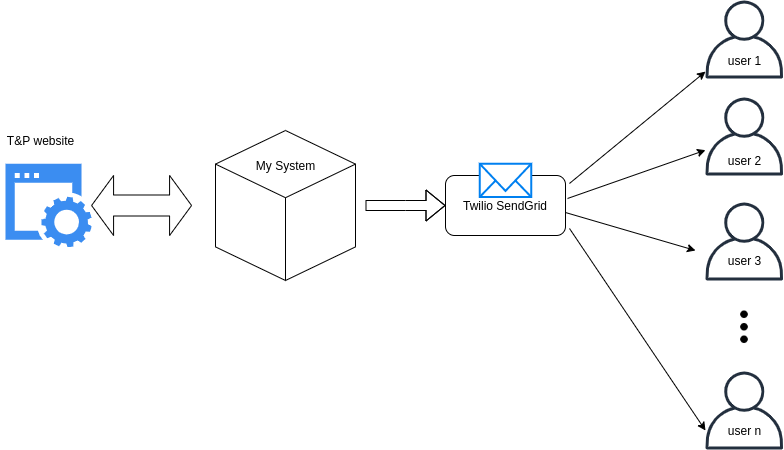

# BIT Training and Placement Alert

## Index
1. [What is this?](#what-is-this)
2. [Why is this?](#why-is-this)
3. [Is it a need or want?](#Is-it-a-need-or-want?)
4. [What is the inspiration behind?](#What-is-the-inspiration-behind?)
5. [System Setup](#System-Setup)
6. [How to install and run](#How-to-install-and-run?)
7. [Changes to be made from your end](#Changes-to-be-made-at-your-end)
8. [Technical Details](#Technical-Details)
9. [Cost Concern](#Cost-Concern)[
10. [My proposal](#My-proposal)
11. [Contact](#Contact)

## What is this?
This is a end-to-end feasible, and deployable system, which aims to deliver every notification alert and new job update from the T&P portal to all BIT students to their email and sms (in case one doesn't have active internet).

## Why is this?
Upon observing the activity of our T&P website, where notifications demand very quick response from students, and also there are companies which close their aplication portal very soon, there is really very narrowed scope for students. Especially in this time, where students face metered interenet connections, some miss applying to job, while others even after being fully eligible, miss a quick notification.

## Is it a need or want?
As for the student community, this is the prime need. When it comes to placement, everyone wants to be aware and notified about each and every happenings in the T&P. But missing out on this, due to low internet speed, or simply not checking the website every 10 minutes does a great damage.

## What is the inspiration behind?
Well, the inspiration is often great about projects, but this time it's not.
1. One of my batchmates, even after applied for a company, but couldn't sit for it because, the company wanted the resumes of all applicants within a timeframe of 2 hours a day before the exam. He missed to see the notification for the same, within those 2 very crucial hours.

2. One of my seniors, couldn't apply for a job he waited for, for last 3 years because the company closed the application window soon. This incident left a deep imprint. He was depressed, mentally unstable for few days, which cost him another company.

These incidents really broke my heart. I wanted to device a solution for this, so that no one in future face these unstandable situations.


## System Setup



## How to install and run
The entire Project is open source. The auditors and technicals experts are recomended to give it a look. 

Get into a linux instance, prefereably Debian based (Ubuntu, Elementary, Kali, etc.)

> Prefer a cloud instance, it provides an exponential downloading speed.

Start a terminal session as a root user, and proceed further.

1. Clone the repo

```
$ git clone https://github.com/greyhatlinux/BIT-tnp-alert.git
```

2. Go into the Folder BIT-tnp-alert
```
$ cd BIT-tnp-alert/
```
3. Permit the *setup.sh* file to run as an executable.
```
$ chmod +x setup.sh
```
4. Run the bash file
```
$ ./setup.sh
```
5. Hang in, or take a tea break.
The setup files are huge, may take more than 15 minutes on cellular networks. 

6. Once the system is setup, you're expected to make few changes from your end, to make it run.


## Changes to be made at your end

1. In the file *mods/logging.py*, fill the sections with your T&P creds
- < registered email >
- < your password >

2. In the file *mods/broadcast.py*, fill
- < registered email id with Twilio >
- < Twilio sendgrid API Key > 

3. In the file *mods/notify.py*, enter
- the desired email id(s) in the list **mem**


## Technical Details
###  [Selenium ](https://www.selenium.dev/)

It uses selenium in the backend to reach out to the BIT tnp portal every 15 minutes. Selenium is a powerful and open-source browser automation toolkit. It provides a toolset for web browser automation that uses the best techniques available to remotely control browser instances and emulate a user’s interaction with the browser, giving a wide scope to the programmer to model the setup, as required.

###  [Server](https://console.aws.com) 

For now, my setup is based on an AWS t2-micro instance. Its a dedicated server. But, this can be easily setup in any insatnce, of any size. Due to its minimilistic design, this can even be hosted on a shared insance, making sure that the port 80 is exclusively assigned to this application.

Available options for an instance : 
- GCP
- Azure
- Linode

###  [Emailing Service](https://twilio.com)

I've used twilio as my email broadcast service provider. My choice is based on the extreme performance it provides, as well as its easy-to-go integration technique. For personal use, its the best service as of now. However, for a large mass, this can be very costly because of the aforementioned reasons.

Available alternatives : 
- Mailgun
- Mailchimp

### Sms
The sms broadcast service isn't intergrated in the platform. Reason being, I couldn't find any ready-to-go other mass message service provider other than Twilio. Every service provider presented a "Contact" page, whose reply never came.
Even for personal use case, twilio pricing was not feasible.  

Alternatives : 
- way2sms
- SpringEdge 


## Cost Concern

Considering :

<li> 2000 students sitting for FTE and Internship (4th year and 3rd year)
<li> 10 updates in T&P portal per day
<li> So, that makes 20,000 notifications per day
<li> and for 30 days month, it is 600,000 notifications per month <br>
<br>

Subscription Charges :

<li> Email : 

[Email Pricing](https://sendgrid.com/pricing/ "Twilio sendgrid email")

<li> SMS :

[SMS Pricing](https://www.twilio.com/sms/pricing/in "Twilio sms")
<br><br>

> As I mentioned before, twilio can be very costly for sms broadcast, as well as emailing. One can easily look for other alternatives.

## My Proposal 

I assure that the setup can be very efficient, and economical for small friend circles, almost at no cost at all, if utilised tactfully. Using the AWS first-year benifits (750 hour of Ec2 per month), along with Twilio Sendgrid's incentive (free 100 mails/day forver), the setup comes at no cost for the first year. 

I encourage small college groups to setup the system for themselves for free atleast for the first year, and even later the cost will be negligible per-head.


## Contact 
vishalgorai09@gmail.com

